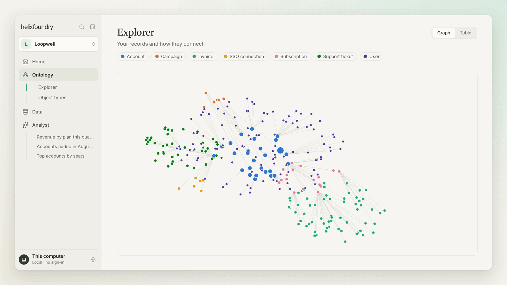

<h1 align="center">
  <picture>
    <source media="(prefers-color-scheme: dark)" srcset="docs/assets/logo-dark.svg">
    
  </picture>
</h1>

<p align="center">
  <strong>Your company's data, connected into one ontology, on your own computer.</strong>
</p>

Helix Foundry is a local-first data workspace built on [HelixDB](https://docs.helix-db.com) and [DuckDB](https://duckdb.org). Connect the tools your company already runs on, such as your database, Stripe, WorkOS, PostHog, files and APIs, and it suggests one connected ontology across them that you can explore and ask questions of. There are no accounts and nothing to host: it runs on your computer, and AI runs locally by default.

<p align="center">
  
</p>

## Get started with your coding agent

You need [Docker](https://docs.docker.com/get-started/get-docker/) installed and running. The first run downloads several GB, so give it a few minutes.

Paste this prompt into Claude Code, Codex, Cursor or any coding agent that can run terminal commands:

```text
Set up Helix Foundry on this computer.

Clone https://github.com/helixdb/helix-foundry.git (or use the copy I already
have), cd into it, then read AGENTS.md and follow it to install, start and
verify the app. Ask me before doing anything that deletes data or stops
something that is already running. When it is ready, give me the URL and
tell me what to do next.
```

Your agent will ask you to approve `git`, `docker` and network commands as it goes. Approve them one at a time rather than allowing every `docker` command up front; the runbook asks before anything that deletes data.

**What your agent will do**

- Check that Docker is running and that the app's port (3001 by default) is free, and pick another port if it is not.
- Generate local encryption keys in `.env` with `scripts/setup.sh`.
- Build and start the stack with Docker Compose, including a local AI model. On a Mac where Ollama is already running, it uses that instead.
- Wait for the health check to pass, then give you the URL.

**What you do next**

1. Open the URL (http://localhost:3001 by default). There is no account to create.
2. Guided setup takes you through **AI → Data → Ontology**. Choose Local, Claude or OpenAI. Connect your data, or choose **Continue with sample data**. Then confirm the suggested ontology.
3. Home opens with your key metrics. Ask anything about your data from the box at the top.

You enter Claude or OpenAI keys and database credentials yourself, in the browser. Your agent never needs them.

## Manual quick start

You need Docker with Compose v2 (see [requirements](#requirements)).

```sh
git clone https://github.com/helixdb/helix-foundry.git
cd helix-foundry
./scripts/setup.sh --compose
```

`setup.sh` writes fresh keys to `.env` if it does not exist yet, then builds and starts the app, a background worker, the DuckDB executor, HelixDB and Ollama. The first run builds the image and downloads HelixDB, Ollama and the `qwen3:4b` model (roughly 2.5 GB), so give it several minutes.

It is ready when the health check answers:

```sh
curl -fsS http://localhost:3001/api/health
# {"ok":true,"service":"helix-foundry"}
```

Then open **http://localhost:3001**. The model keeps downloading in the background, and you can start setup before it finishes.

**Port 3001 already in use?** Create `.env` first, then set the port and the matching origin together:

```sh
./scripts/setup.sh                                   # creates .env with fresh keys
echo 'PUBLIC_PORT=3005' >> .env
echo 'PUBLIC_ORIGIN=http://localhost:3005' >> .env
./scripts/setup.sh --compose
```

Add the two lines once; if `.env` already has them, change their values instead. Always change both. If only the port changes, pages load but every save fails with `403 Origin is not allowed`.

**Apple Silicon.** Docker cannot use Metal, so local AI is faster with native [Ollama](https://ollama.com). Start Ollama, then run the stack without the bundled model:

```sh
./scripts/setup.sh
grep -q '^MODEL_ENDPOINT=' .env || echo 'MODEL_ENDPOINT=http://host.docker.internal:11434' >> .env
docker compose up -d --build
```

This relies on Docker Desktop, which provides `host.docker.internal`. With another Docker runtime, use the default command above.

## Requirements

- **Docker** with the Compose v2 plugin (`docker compose`, not `docker-compose`). Checked with Compose 2.29.
- **git, bash and openssl** for the setup scripts.
- **Disk:** several GB for the first run: the app image (about 0.9 GB), HelixDB, Ollama and the `qwen3:4b` model.
- **Memory:** local AI was developed and benchmarked on a 16 GB machine. Give Docker enough memory for the model, or choose Claude or OpenAI during setup.
- **Node.js 24 and pnpm 10.7**, only for [local development](#local-development).

Helix Foundry is developed and validated on macOS with Apple Silicon, and CI runs on Linux. Windows is untested, and the scripts need bash.

## What you get

- **Connectors** for Neon, Supabase, PlanetScale, PostgreSQL, MySQL, Stripe, WorkOS, PostHog, REST APIs, S3-compatible storage, file uploads (CSV, JSON, JSONL, Parquet) and an ingestion API.
- **Automatic sync** through native PostgreSQL and MySQL change capture where the database allows it, and scheduled snapshot refreshes otherwise.
- **A suggested ontology** that matches the same customers and records across sources, stored as real objects and relationships in HelixDB.
- **Versioned data:** immutable Parquet snapshots with profiles, schema-drift review and history, queried by isolated DuckDB processes.
- **Home and Analyst:** key metrics, and answers to your questions backed by executed SQL with snapshot citations.
- **Your choice of AI:** local `qwen3:4b` through Ollama by default, or Claude or OpenAI. AI-proposed changes are tested and wait for your review.
- **Developer access:** OpenAPI at `/api/docs`, a TypeScript SDK, scoped API tokens, and backup and restore scripts.

The full feature list, connector details and architecture are in the [guide](docs/GUIDE.md).

## Everyday commands

Run these from the repository. If you use native Ollama, leave out `--profile local`.

```sh
docker compose --profile local ps -a                # status
docker compose --profile local logs -f app worker   # follow logs (Ctrl+C to stop)
docker compose --profile local stop                 # stop
docker compose --profile local up -d                # start again
```

The stack starts again with Docker unless you stopped it.

**Upgrade.** Back up first, then pull and rebuild:

```sh
./scripts/backup.sh ~/helix-foundry-backups/$(date +%Y%m%d-%H%M%S)
git pull
docker compose --profile local up -d --build
```

**Back up and restore.** `./scripts/backup.sh PATH` briefly stops the services, archives the HelixDB and data volumes, and copies `.env` as `config.env`. Keep backups private and outside the repository, because `config.env` holds your encryption key. `./scripts/restore.sh PATH --replace` replaces the current data and `.env` with a backup.

Never run `docker compose down -v` unless you mean to delete everything. It removes all workspaces, imported data and stored credentials. See [operations](docs/OPERATIONS.md) for upgrades, change capture and limits.

## Local development

Use Node.js 24 and pnpm 10.7. Run HelixDB in Docker and the app natively:

```sh
pnpm install
./scripts/setup.sh
docker run -d --name helix-foundry-dev -p 127.0.0.1:6996:8080 \
  -e HELIX_DATA_DIR=/var/lib/helix -v helix-foundry-dev:/var/lib/helix \
  ghcr.io/helixdb/helixdb:v0.0.6@sha256:94b29942658ebdca0a91bf15edffe921a46da3e26e1223ea333ccce58c6212dd
pnpm dev
```

Open **http://localhost:5173**. `pnpm dev` runs the API on 3001, the executor on 3002 and the web app on 5173. Local AI also needs Ollama on port 11434 (`ollama serve`). Before opening a pull request, run the same checks as CI: `pnpm typecheck`, `pnpm test` and `pnpm build`. The [guide](docs/GUIDE.md#local-development) covers tests, ports and the SDK.

## Security model

Helix Foundry is built for one person on their own computer. There are no accounts and no sign-in, so anyone who can reach the app controls every workspace.

- The app is published on `127.0.0.1` only. Never expose it with a reverse proxy, tunnel or port forward, and never publish the internal HelixDB, executor or Ollama ports.
- The API rejects requests whose `Host` is not this computer, and browser changes from any other origin, with `403`.
- Connector and AI credentials are encrypted with `ENCRYPTION_KEY` from `.env`. Keep `.env` and backups private and out of git. If you lose the key, stored credentials cannot be recovered. Do not try to rotate it by replacing the value.
- Generated SQL runs in a separate DuckDB executor on an internal network with no internet access, no connector credentials, no Linux capabilities, and memory and process limits.
- Scripts and the SDK use workspace-scoped API tokens from **Settings → Developer tools**. Tokens are read-only unless you grant write access.

## Documentation

| Document                                 | What it covers                                                                    |
| ---------------------------------------- | --------------------------------------------------------------------------------- |
| [AGENTS.md](AGENTS.md)                   | Runbook for coding agents: preflight, setup, verification and troubleshooting     |
| [docs/GUIDE.md](docs/GUIDE.md)           | Features, connectors, AI and review, architecture, development and testing        |
| [docs/onboarding.md](docs/onboarding.md) | Onboarding API routes, SDK methods and import limits                              |
| [docs/OPERATIONS.md](docs/OPERATIONS.md) | Install profiles, diagnostics, change capture, backup, restore, upgrades, limits  |
| [docs/HOSTING.md](docs/HOSTING.md)       | Neon, Supabase and PlanetScale sign-in, scopes and permissions                    |
| [docs/API.md](docs/API.md)               | REST API reference, authentication and the TypeScript SDK                         |
| [docs/VALIDATION.md](docs/VALIDATION.md) | Test results, benchmarks and known limits from the September 2026 validation runs |

## License

Helix Foundry is released under the [Apache License 2.0](LICENSE). See [NOTICE](NOTICE) for attribution.
